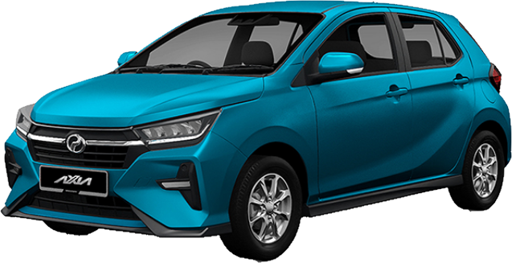

# peroduasales
<!DOCTYPE html>
<html lang="en">
<head>
    <meta charset="UTF-8">
    <meta name="viewport" content="width=device-width, initial-scale=1.0">
    <title>Perodua Sales Advisor</title>
    <link href="https://fonts.googleapis.com/css2?family=Poppins:wght@300;400;600&display=swap" rel="stylesheet">
    
    
</head>
<body onload="switchLanguage('en')">
    <header>
        Welcome to Perodua Sales - Premium Experience / Selamat Datang ke Perodua Sales - Pengalaman Premium
    </header>
    

        <button class="btn-en" onclick="switchLanguage('en')">English</button>
        <button class="btn-my" onclick="switchLanguage('my')">Bahasa Malaysia</button>
    

    <section id="en">
        <h2>Our Premium Car Models</h2>
        

            
            
            
        

        <h2>Exclusive Promotions</h2>
        
Unlock the best financing options and limited-time offers!

        <a href="#contact" class="cta-button">Get Offer Now</a>
    </section>
    <section id="my">
        <h2>Model Kereta Premium Kami</h2>
        

            
            
            
        

        <h2>Promosi Eksklusif</h2>
        
Dapatkan tawaran pembiayaan terbaik dan promosi terhad!

        <a href="#contact" class="cta-button">Dapatkan Tawaran</a>
    </section>
    <footer>
        &copy; 2025 Perodua Sales Advisor | Premium Automotive Experience
    </footer>
</body>
</html>
